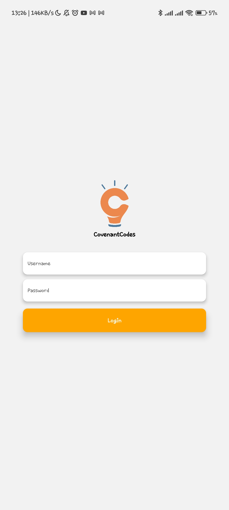
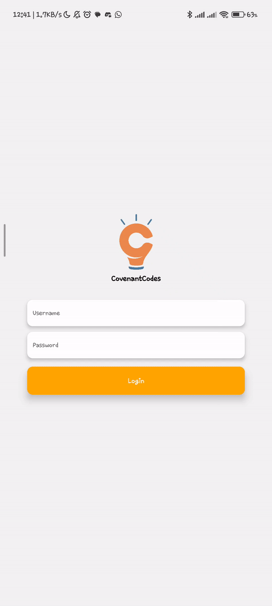

# demoReactContext

This project demonstrates the usage of React Context for managing shared data in a React Native application. It includes a simple login form and a user profile screen, along with navigation between these screens.

## Table of Contents

- [demoReactContext](#demoreactcontext)
  - [Table of Contents](#table-of-contents)
  - [Getting Started](#getting-started)
    - [Installation](#installation)
  - [Running the App](#running-the-app)
  - [Usage](#usage)
  - [Screenshots](#screenshots)
  - [Demo](#demo)
  - [Contributing](#contributing)

## Getting Started

### Installation

Clone the repository:

   ```bash
   git clone https://github.com/yourusername/demoReactContext.git
  ```

Change to the project directory:

 ```bash
cd demoReactContext
   ```

Install Dependecies:
 ```bash
npm install
   ```

## Running the App
Ensure you have either an Android emulator or a physical device connected before proceeding.

To run the app on Android:
``` bash
npx react-native run-android
```

To run the app on iOS:
``` bash
npx react-native run-ios
```

## Usage
1. Launch the app on your device or emulator.

2. The app will start on the login screen. Enter a username and password (no validation is implemented in this demo).

3. Click the "Login" button.

4. You will be navigated to the user profile screen where the user's information will be displayed.

## Screenshots


## Demo

Insert gif or link to demo



## Contributing
Contributions are welcome! If you find any issues or want to enhance the app, feel free to open a pull request.

1. Fork the repository.

2. Create a new branch for your feature or bug fix: git checkout -b feature/my-feature or git checkout -b bugfix/my-bugfix

3. Commit your changes: git commit -m 'Add some feature'

4. Push the branch to your fork: git push origin feature/my-feature

5. Open a pull request in this repository.